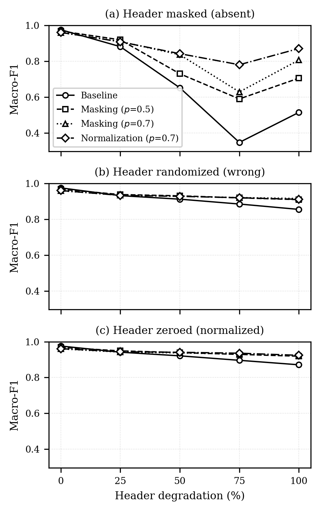

# Selective Header Masking for Robust Encrypted Traffic Classification

Encrypted traffic classifiers built on pre-trained transformers reach near-perfect
accuracy on clean benchmarks, but much of that accuracy rests on a handful of
transport-layer header bytes. When those bytes are missing or corrupted in the
field — partial captures, middlebox rewriting, truncation — accuracy can collapse
without warning.

This project introduces **selective header masking**: a lightweight change to the
fine-tuning recipe that randomly hides the residual TCP-header tokens during
training, forcing the model to rely on the rest of the packet. The result is a
classifier that degrades *gracefully* instead of catastrophically.

> **Accepted at IEEE CCSS 2026** (full paper, oral presentation). DOI to follow
> once the proceedings appear on IEEE Xplore.
>
> Built on [ET-BERT](https://github.com/linwhitehat/ET-BERT) (Lin et al., WWW '22).
> See [Acknowledgements](#acknowledgements).

## Headline result

Under progressive header degradation on **USTC-TFC2016** (20 classes), a
conventionally fine-tuned classifier loses most of its discriminative ability
when the residual TCP header is removed. Suppressing that region during
fine-tuning largely prevents the collapse.

Averaged over three random seeds, **normalization retains 0.846 macro-F1 under
complete header loss where the baseline retains 0.528** — and it does so with
roughly five times less variance from one training run to the next.

| Macro-F1, header omitted | Clean | 50% | 100% |
|--------------------------|:-----:|:---:|:----:|
| Baseline                 | 0.976 | 0.652 | 0.514 |
| Masking (p = 0.7)        | 0.960 | 0.836 | 0.807 |
| **Normalization (p = 0.7)** | 0.961 | 0.842 | **0.871** |

*Single seed (7), matching the per-model tables. Across seeds 7/17/27 the
baseline spans 0.389–0.680 at full omission (sd 0.146) while normalization
spans 0.819–0.871 (sd 0.026).*



The gains hold under a corruption pattern never seen during training
(randomized rather than omitted headers) and under deliberate adversarial
manipulation, indicating genuine header-invariance rather than memorization of
a single failure mode. Clean-data accuracy costs about 1.6 points.

### Other results

| Experiment | Finding |
|------------|---------|
| Adversarial header manipulation | Baseline loses 17.8 macro-F1 points to a black-box header transplant and 20.4 to a white-box gradient attack; suppression retains 10–12 points more under both |
| Deterministic removal | Extending the prefix strip from 38 to 54 bytes is invariant by construction and *beats* suppression under full omission (0.947 vs 0.897), but cannot classify 4.1% of packets, concentrated in malware |
| Suppressed region size | 16 tokens, the true residual header, is the empirical optimum; 8 leaves exploitable bytes, 24 and 32 eat into the payload |
| Overhead | No added parameters, inference unchanged, training step cost below 0.4% |

Every number above is reproducible from the tables in [`results/`](results/).

## What's new in this repo

The contribution is implemented in these files (everything else is the ET-BERT base):

| File | Purpose |
|------|---------|
| [`fine-tuning/run_classifier_mask.py`](fine-tuning/run_classifier_mask.py) | Fine-tuning with selective header suppression (`--mask_rate`, `--header_tokens`, `--mask_op`) |
| [`make_degraded_tests.py`](make_degraded_tests.py) | Builds degraded test sets (omission / randomization / zeroing, 0–100%) |
| [`make_stripped_dataset.py`](make_stripped_dataset.py) | Builds the 38→54 byte deterministic-strip variant |
| [`eval_degradation.py`](eval_degradation.py) | Evaluation-only sweep producing the degradation matrix |
| [`eval_preds.py`](eval_preds.py) | Per-sample prediction export, for resampling-based analysis |
| [`eval_strip54.py`](eval_strip54.py) | Scores the deterministic-strip baseline on a common packet subset |
| [`adversarial_header.py`](adversarial_header.py) | Header transplantation and HotFlip attacks |
| [`bench_overhead.py`](bench_overhead.py) | Training and inference overhead measurement |
| [`bootstrap_ci.py`](bootstrap_ci.py) | Paired bootstrap confidence intervals |
| [`plot_degradation.py`](plot_degradation.py), [`plot_perclass_bar.py`](plot_perclass_bar.py) | Figures |
| [`reproduce.sh`](reproduce.sh) | Rebuilds figures from tracked tables; `all` runs the full pipeline |

## Reproducing the experiments

The figures rebuild from a fresh clone, since the result tables are tracked:

```bash
pip install -r requirements.txt
./reproduce.sh              # -> results/fig_degradation.pdf, fig_perclass_bar.pdf
```

Rebuilding the tables themselves needs the dataset and the pre-trained
checkpoint, and roughly 50 GPU-hours to fine-tune the ten variants:

1. **Environment** — Python 3.10, PyTorch 2.x. Works on CUDA or Apple MPS.
2. **Data** — Obtain [USTC-TFC2016](https://github.com/yungshenglu/USTC-TFC2016) and
   preprocess with `data_process/` into train/valid/test TSVs. See that script for
   the pipeline (byte-bigram tokenization; the first 38 bytes — Ethernet + IPv4 +
   ports — are stripped, leaving the 16-byte residual TCP header as the masking target).
3. **Pre-trained model** — download `pre-trained_model.bin` from the
   [ET-BERT release](https://github.com/linwhitehat/ET-BERT).
4. **Fine-tune with masking:**
   ```bash
   PYTHONPATH=. python -u fine-tuning/run_classifier_mask.py \
     --pretrained_model_path models/pre-trained_model.bin \
     --vocab_path models/encryptd_vocab.txt \
     --train_path datasets/<your>/train_dataset.tsv \
     --dev_path   datasets/<your>/valid_dataset.tsv \
     --test_path  datasets/<your>/test_dataset.tsv \
     --epochs_num 10 --batch_size 32 --seq_length 128 --learning_rate 2e-5 \
     --embedding word_pos_seg --encoder transformer --mask fully_visible \
     --mask_rate 0.7 --header_tokens 16 --mask_op mask \
     --output_model_path models/finetuned_masked_p70.bin
   ```
5. **Build degraded tests, evaluate, and plot:**
   ```bash
   python make_degraded_tests.py
   python eval_degradation.py
   python plot_degradation.py   # -> results/fig_degradation.pdf
   ```

> Trained weights (`*.bin`) and datasets are not tracked here due to size; the steps
> above reproduce them from the public ET-BERT base model and USTC-TFC2016.

## What the peer review changed

The submitted version was revised in response to two reviews. Two of the
changes altered conclusions rather than presentation, and are worth stating
plainly.

**A reviewer proposed a simpler baseline, and it wins in one regime.** Rather
than suppressing the header stochastically, extend ET-BERT's prefix strip from
38 to 54 bytes and delete the region outright. Measured on the packets both
methods can process, that baseline is flat at 0.947 macro-F1 and therefore
*beats* normalization under complete header omission, where normalization falls
to 0.897. It is reported that way in the paper. The case for suppression rests
on the rest of the picture: 1.9 points more clean accuracy, graceful degradation
across the range rather than a fixed ceiling, and full coverage, since a 54-byte
strip is longer than 4.1% of packets and those cannot be classified at all.
Their flat 0.947 is also independent evidence for the paper's central claim,
because it shows payload structure alone supports accurate classification.

**Running multiple seeds invalidated the headline number.** The submission
claimed a "fivefold" reduction in degradation. Bootstrap resampling put that at
5.11× with a 95% interval of [4.81, 5.42], already below the threshold. Training
at three seeds then showed the ratio ranges 2.12× to 5.28×, because the
*baseline's* collapse is highly seed-dependent (0.389 to 0.680) while
normalization is stable (0.819 to 0.871). A ratio of two noisy quantities was
the wrong statistic. The headline was rewritten in absolute terms, which is
stable, and the variance reduction became a finding in its own right.

## Acknowledgements

This work builds directly on **ET-BERT**:

> Xinjie Lin, Gang Xiong, Gaopeng Gou, Zhen Li, Junzheng Shi, Jing Yu.
> *ET-BERT: A Contextualized Datagram Representation with Pre-training Transformers
> for Encrypted Traffic Classification.* WWW 2022.
> [Paper](https://dl.acm.org/doi/10.1145/3485447.3512217) ·
> [Code](https://github.com/linwhitehat/ET-BERT)

The base model architecture, tokenization, and pre-training code originate from the
ET-BERT repository (MIT License). The selective masking strategy, degradation
protocol, evaluation sweep, and analysis in this repository are my own contribution.
